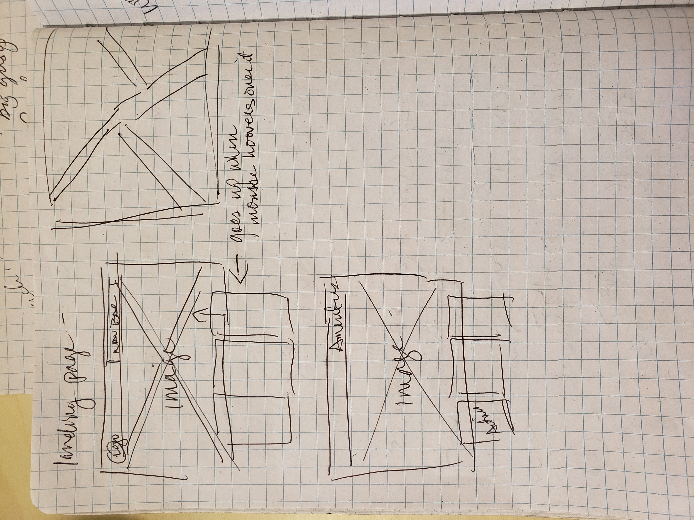
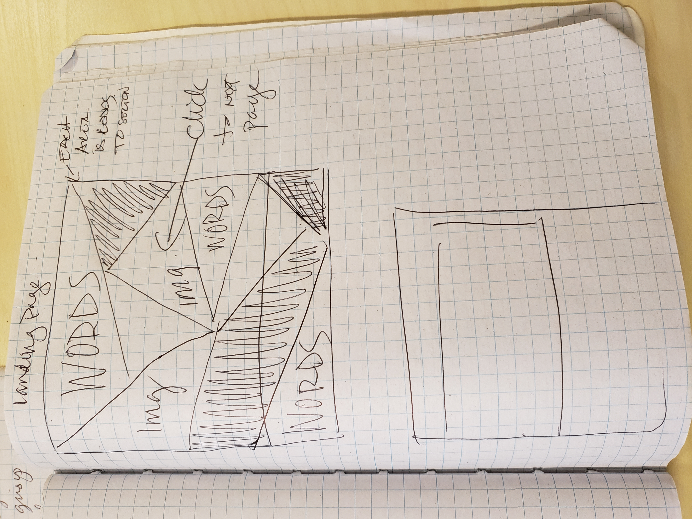
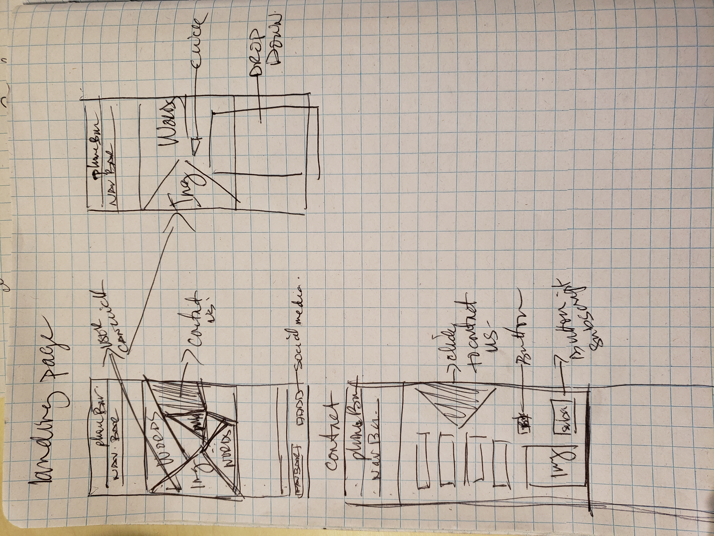
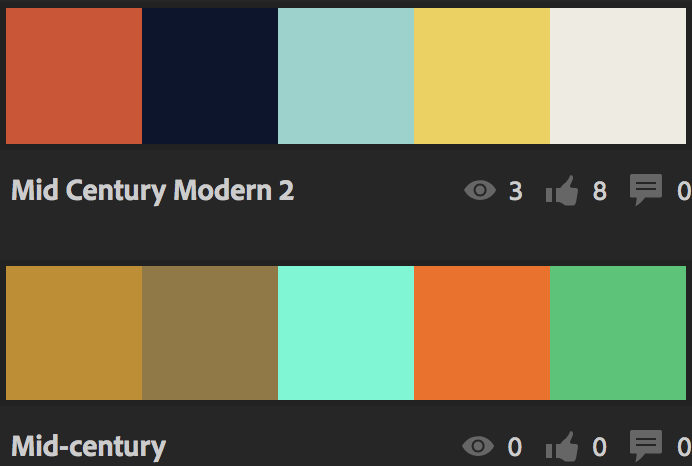

## Freelance Project
---

#### Victoria Martinez
#### February 22, 2019

### Notes Images

### Brainstorming
  Colors or Themes:
  * Mid Century Modern
  * Colors:
  
    1. D94C2A, 0A152E, 8CD3CD, F0D04B, EEECE1, EDB823, 4F94A4,
    2. C78C18, 94773E, 44FAD4, FA6A06, 18C771

  * Industrial, white, airy, plants, large prints, neon lights, words play, light wood

  Keywords:
  * Luxurious
  * Cool
  * High-end
  * 100% inclusive
  * safe
  * comfortable
  * productive
  * creative
  * funky
  * artists
  * day-traders
  * craft people
  * writers
  * counselor
  * business people

### Technologies  

  * Sketch
  * Atom
  * Html
  * css
  * sass  
  * Webpack

### Resources

  * [adobe color cc](https://color.adobe.com)
  * [society6](https://society6.com)
  * [unsplash](https://unsplash.com)
  * [mid century images](https://www.google.com/search?q=google+images+mid+century)
  * [goole fonts](https://fonts.google.com/)
  * [anmiate.css](https://daneden.github.io/animate.css/)

### License

  Copyright (c) 2019 **Victoria Martinez**
