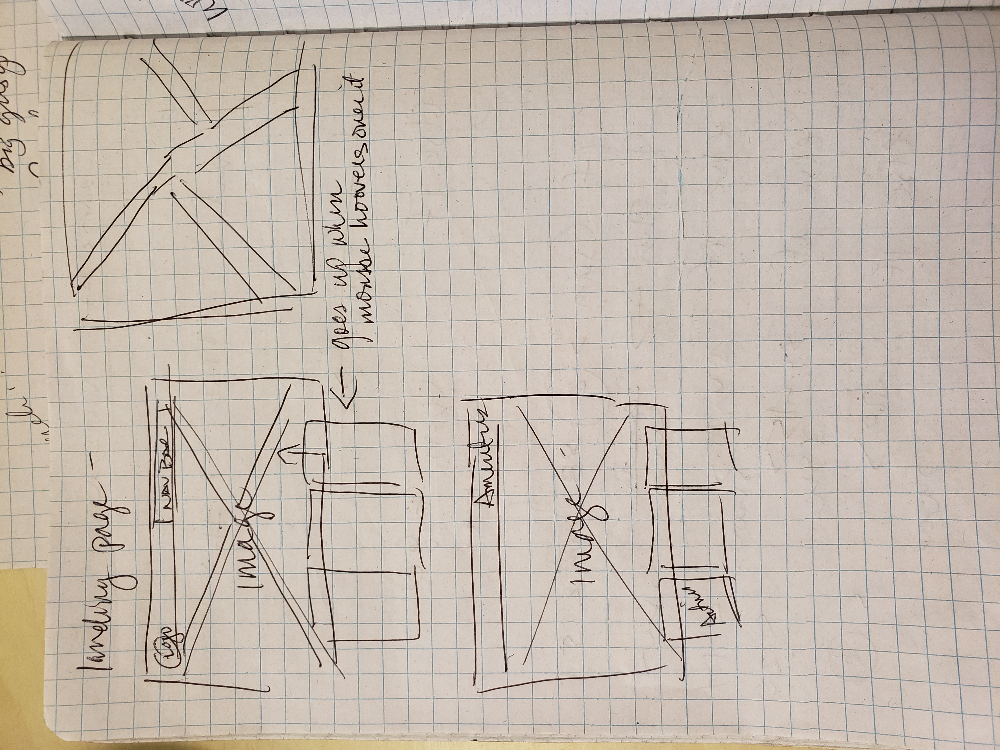
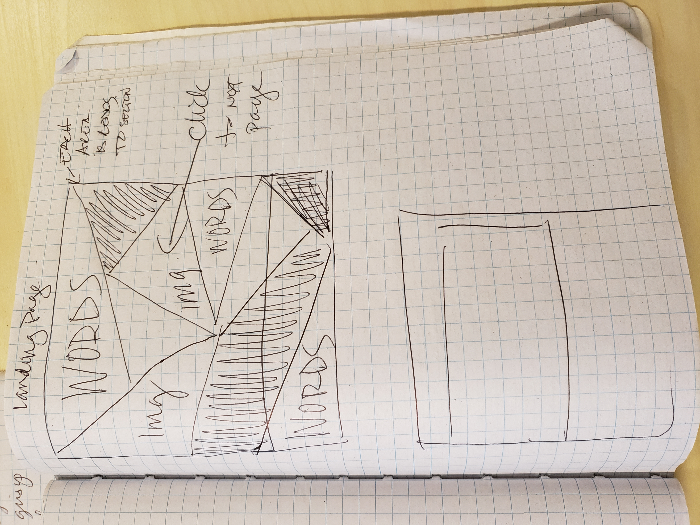
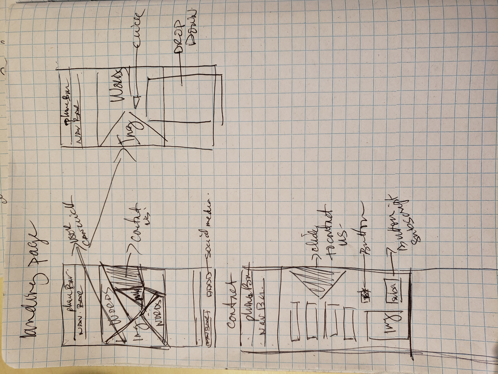
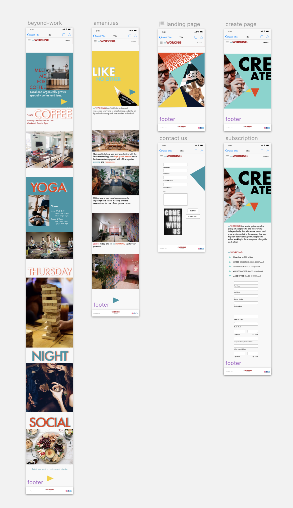
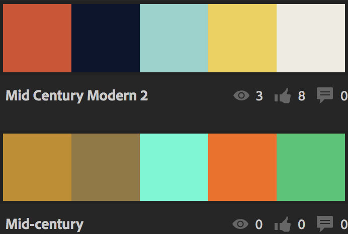

## Freelance Project
---

#### Victoria Martinez
#### February 22, 2019

### Description

Client's requirements:
* Landing page
* Amenities page
* Contact page
* Subscription page

Amenities:
* Coffee counter
* Communal work space
* Private offices
* High speed internet
* Printing & fax services
* Yoga
* Food
* craft activities

### Images

#### Mobile Version

### User Stories

### Persona

1. Freelance/Self Employed (James)
  _I need a dedicated space to work on my current projects._

    Needs:
      * Meet new people to collaborate with
      * Affordable office space where I can have clients come
      * Looking for a place that makes me feel welcome

    Pain points:
      * Cost per month
      * Privacy
      * Technologies: wi-fi, faxing,
      * Place to receive my business mail and packages
      * Will people judge me

    How we can serve:
      * Provide competitive cost
      * Promotes community awareness within the space
      * Provides private offices and communal areas
      * Provides information on latest technologies and business center
      * Site and brand promotes 100% inclusive

  2. Business owner (Chris)
    _I own a accounting agency firm and sometimes need more help with projects_

    Needs:
      * Need to find resources to talented freelance individuals
      * I would like to keep up with the latest business trends

    Pain points:
      * Is there a meet-up available?
      * Will this site help me find freelance individuals

    How we can serve:
      * Site promotes social evening open to the public
      * Site invites passionate and talented individuals from all background, race and gender

  3. Undergrad Student (Martha)
    _I'm an undergrad student working on my thesis in creative writing_

    Needs:
      * I need a space to work on my projects
      * I work long periods of time, both in the day and night
      * I need to be inspired with my writing

    Pain points:
      * Will this place be loud? I need to have full concentration on my writing
      * Is this place only for professional?
      * I don't know what to expect with shared spaces

    How we can serve:
      * Site will showcase the energy, cool, hip space with high quality of offices and amenities
      * Site will provide information about in-house coffee shop, business center and social calendar
      * Site will showcase 100% inclusive and everyone is welcome

### Brainstorming
Colors or Themes:
* Mid Century Modern
* Colors:

  1. D94C2A, 0A152E, 8CD3CD, F0D04B, EEECE1, EDB823, 4F94A4,
  2. C78C18, 94773E, 44FAD4, FA6A06, 18C771

* Industrial, white, airy, plants, large prints, neon lights, wordsplay, light wood

Keywords:
* Luxurious
* Cool
* High-end
* 100% inclusive
* safe
* comfortable
* productive
* creative
* funky
* artists
* day-traders
* craft people
* writers
* counselor
* business people

### Technologies  

* Sketch
* Atom
* Html
* css
* sass  

### Resources

* [adobe color cc](https://color.adobe.com)
* [society6](https://society6.com)
* [unsplash](https://unsplash.com)
* [mid century images](https://www.google.com/search?q=google+images+mid+century)
* [goole fonts](https://fonts.google.com/)
* [anmiate.css](https://daneden.github.io/animate.css/)

### Responsiveness

* Landing page is created with shapes and images which is clickable to the next page.
* small animation was added at the bottom of landing page to let users knows to scroll down

### Setup Instructions

To view Sketch wok:
* download github link to your computer [freelance-project](https://github.com/vmartinezlive/freelance-project.git)
* open Sketch on mac computer
* open file freelance file
* click on preview

To view coed:
* clone [freelance-project](https://github.com/vmartinezlive/freelance-project.git)
* Make sure you have NodeJs and NPM installed (required to view project)
* cd into the root directory and install dependancies by entering: npm install
* after installation enter npm run start on your terminal

### Roadmap

Additional future work:
* Add link for submission to contact user.
* Add reservations request for meeting rooms
* Add calendar events
* Add rules and regulation page after user completes subscription page.

### License

Determine the license under which this application can be used.

Copyright (c) 2018 **Victoria Martinez**
